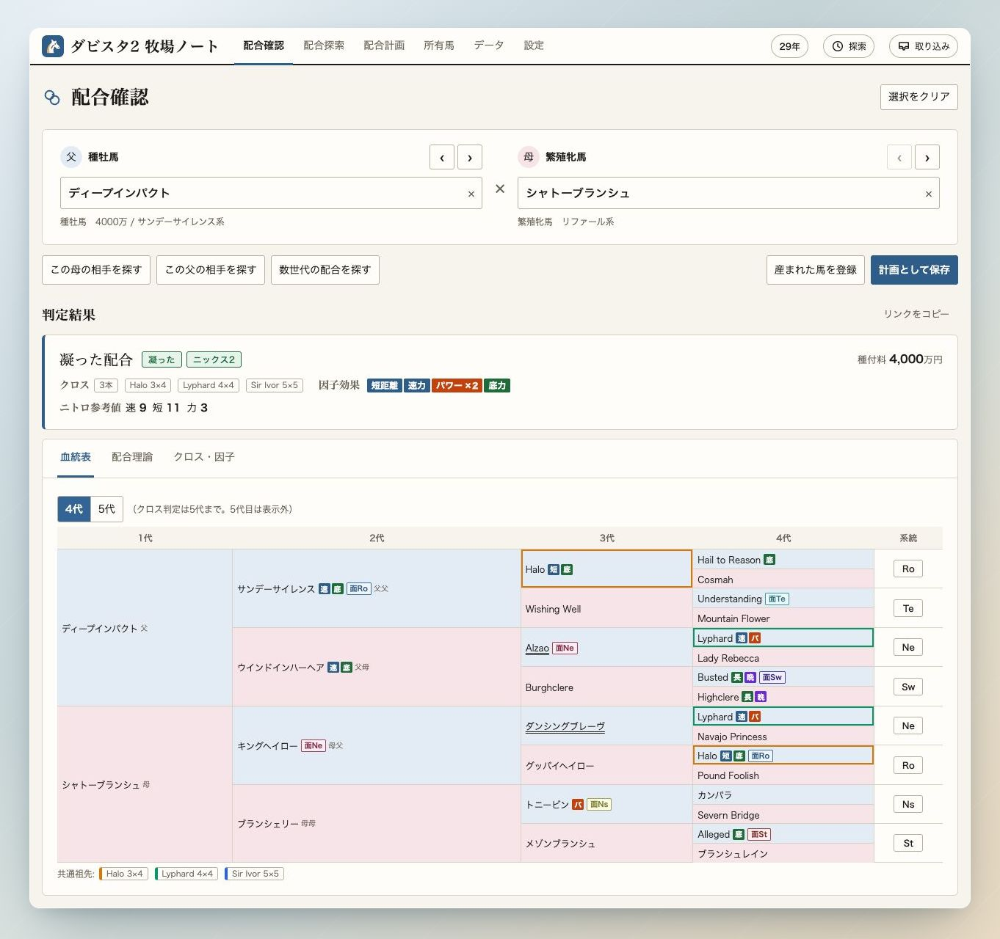
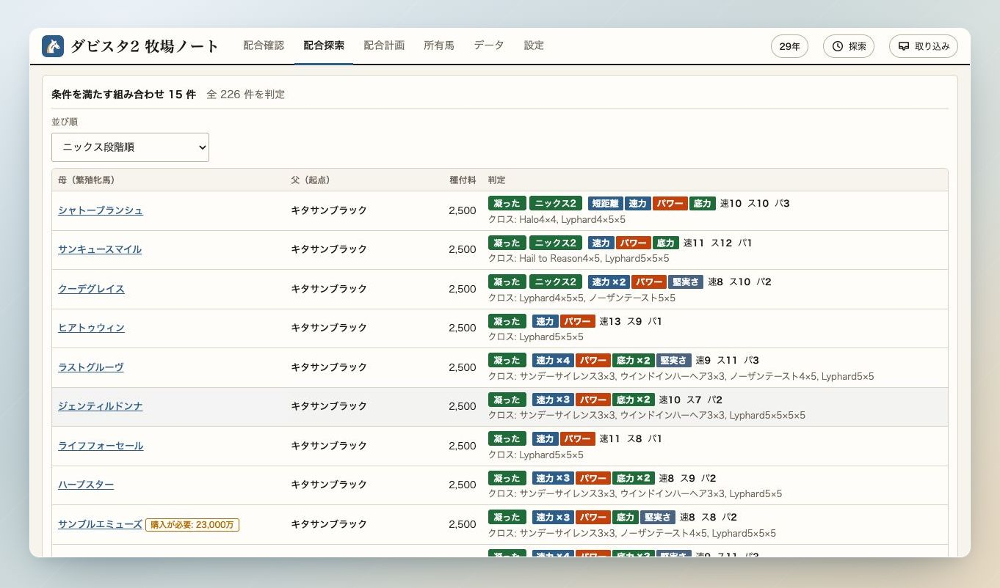
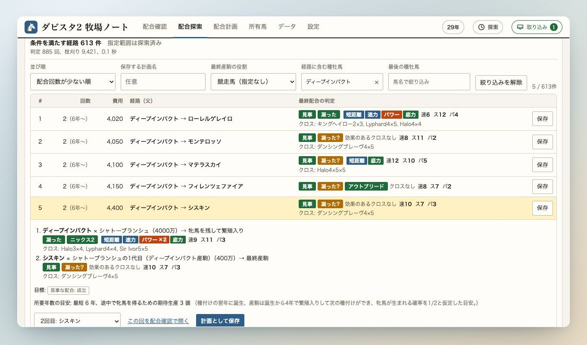
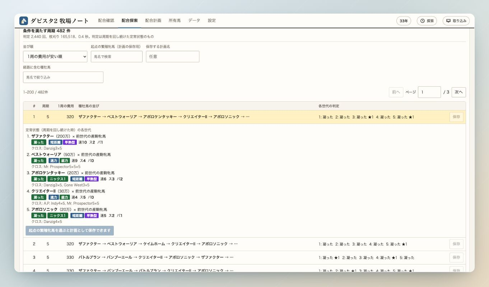
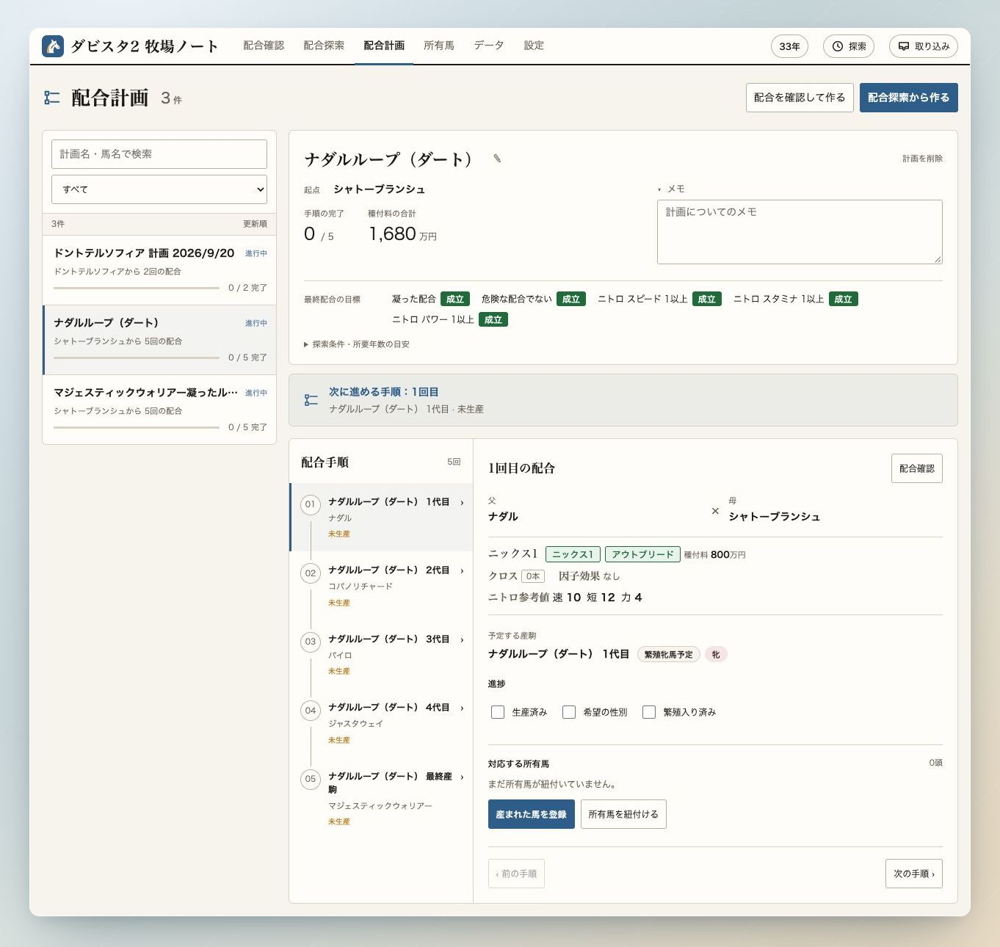

# 配合確認・探索・計画

[マニュアルの目次](README.md)

## 配合確認

父と母を選ぶと、成立する配合理論やニックス、クロス・因子を判定します。
所有馬も、父母の血統を登録していれば選択できます。

最初に表示されるのは産駒の血統表です。
判定の内訳を見たいときは「配合理論」「クロス・因子」に切り替えます。
組み合わせが決まったら「計画として保存」、すでに産まれていれば「産まれた馬を登録」へ進めます。

## 配合探索

### 1世代の総当たり

繁殖牝馬または種牡馬を起点に、相手との組み合わせをまとめて調べます。

1. 起点の馬を選びます。
2. 必ず満たす配合理論、欲しい因子・避けたい因子、ニトロや相手の属性などを指定します。
3. 総当たりを実行し、結果を並べ替えて比較します。
4. 気になる行を開き、血統や判定を確認します。「配合確認で開く」から個別の確認へ進めます。

### 数世代の探索

起点の繁殖牝馬から、目標に合う産駒までの配合経路を探します。
配合回数や種付料の上限を決め、必要に応じて途中・最後に使う種牡馬を指定します。

結果は1行に1つの組み合わせが並びます。
「経路に含む種牡馬」「最後の種牡馬」で絞り込むと、使いたい馬を含む経路を比較しやすくなります。
各経路を開くと世代ごとの判定を確認でき、そのまま計画として保存できます。

数世代探索とループ探索は、サーバ側でのバックグラウンド実行にも対応しています。
別の画面で作業しながら、右上の「探索」から進捗や結果を確認できます。

## 凝った配合ループ探索

種牡馬を一定の順番で使い、凝った配合を繰り返せる周期を探します。
周期の長さ、1周の種付料、種牡馬の属性などを指定して実行します。

結果の行を開くと、周期を回し続けた定常状態での各世代の判定が表示されます。
最初の周回を始める繁殖牝馬との判定は別なので、実際の手順は計画でも確認します。
「起点の繁殖牝馬」を選んで保存すると、配合計画として管理できます。

## 配合計画

保存した計画を選ぶと、種付料の合計、手順の進捗、次に進める配合を確認できます。
手順を切り替えて父母や配合判定を確認し、ゲームの進行に合わせて更新します。

産駒が生まれたら「産まれた馬を登録」から登録するか、「所有馬を紐付ける」で登録済みの馬を選びます。
生産・性別・繁殖入りの進捗には、紐付けた所有馬の情報が反映されます。

計画上の馬と実際の所有馬は別に管理されます。
同じ手順で複数頭を生産した場合や、1頭が複数の計画に対応する場合も紐付けられます。

[所有馬・戦績・命名へ](horses.md)
