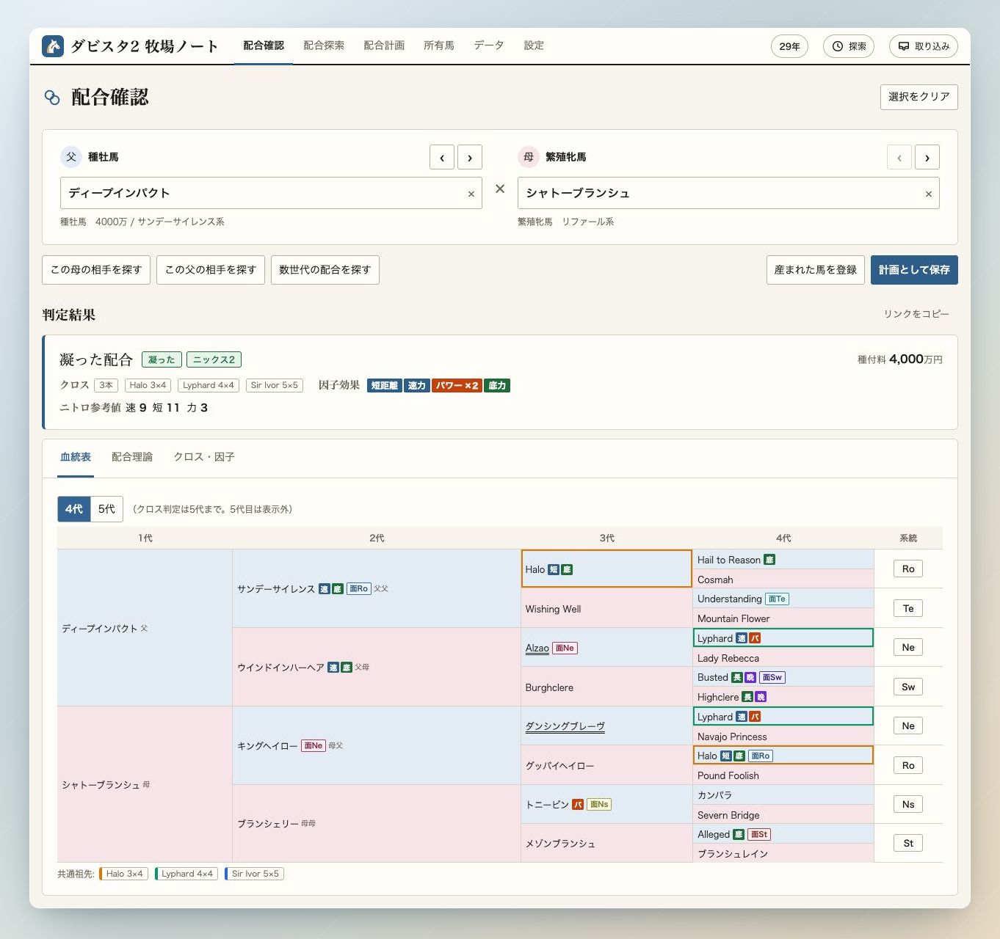
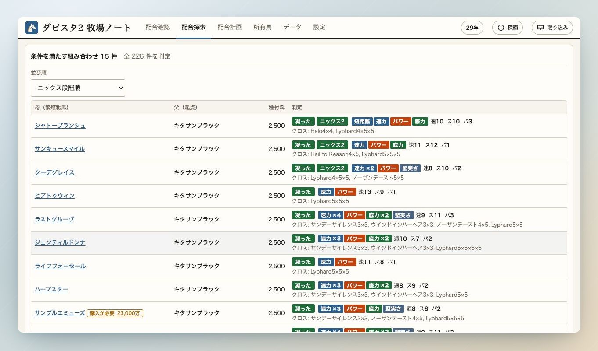
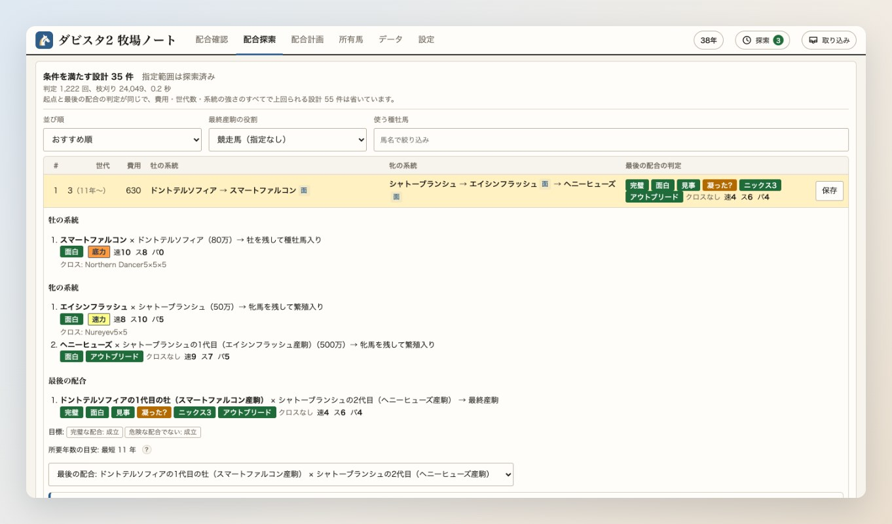
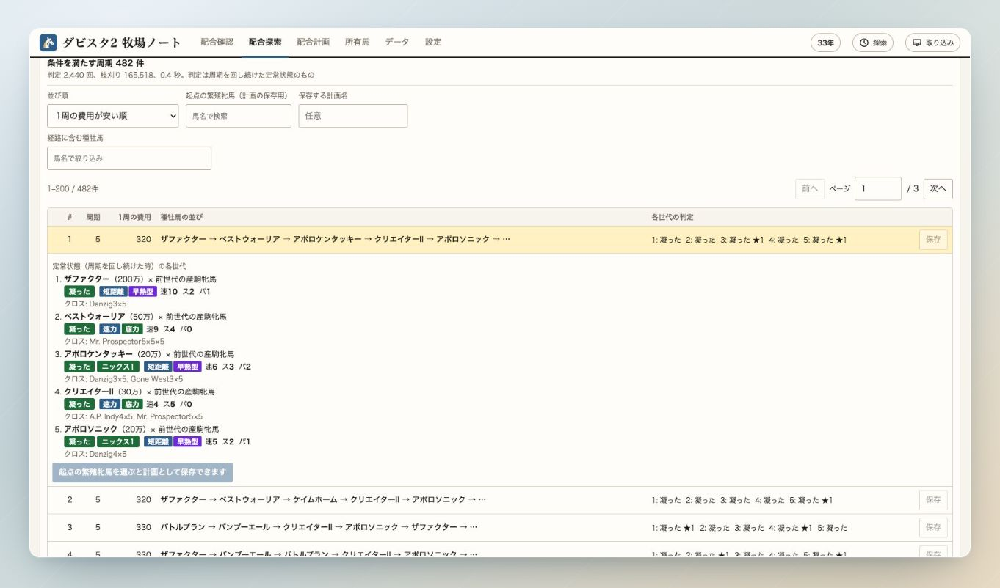
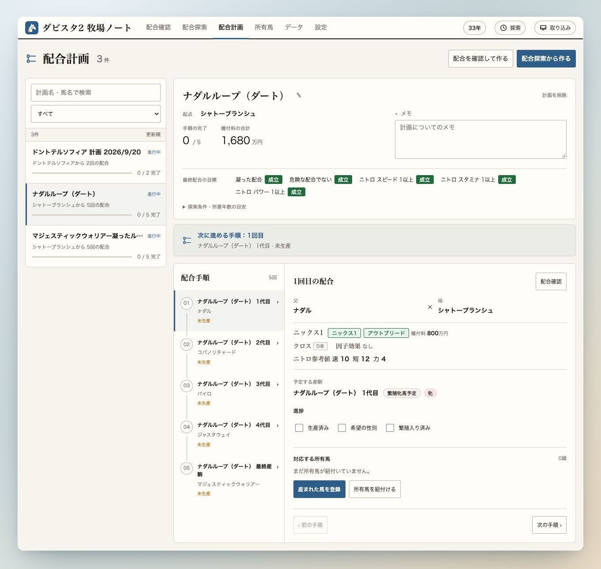

# 配合確認・探索・計画

[マニュアルの目次](README.md)

## 配合確認

父と母を選ぶと、成立する配合理論やニックス、クロス・因子を判定します。
所有馬も、父母の血統を登録していれば選択できます。

最初に表示されるのは産駒の血統表です。
判定の内訳を見たいときは「配合理論」「クロス・因子」に切り替えます。
組み合わせが決まったら「計画として保存」、すでに産まれていれば「産まれた馬を登録」へ進めます。

## 配合探索

### 1世代の総当たり

繁殖牝馬または種牡馬を起点に、相手との組み合わせをまとめて調べます。

1. 起点の馬を選びます。
2. 必ず満たす配合理論、欲しい因子・避けたい因子、ニトロや相手の属性などを指定します。
3. 総当たりを実行し、結果を並べ替えて比較します。
4. 気になる行を開き、血統や判定を確認します。「配合確認で開く」から個別の確認へ進めます。

### 血統設計

最後の配合の父になる牡と、母になる牝を、それぞれ何世代かかけて作る設計を探します。
牡の系統・牝の系統ごとに世代数の範囲を決めます。

- 牡の系統の世代数0は、今いる種牡馬をそのまま父にします。1以上は、起点の繁殖牝馬に種牡馬を付けていき、最後に生まれる牡を種牡馬にして父にします。
- 牝の系統の世代数0は、起点の繁殖牝馬をそのまま母にします。1以上は、種牡馬を付けて牝馬を残していき、最後に生まれる牝馬を母にします。

牡の系統を世代数0にすれば、起点の繁殖牝馬から市販の種牡馬で進める経路の探索になります。
起点は牡・牝それぞれ複数選べます。
起点は最初は空です。「所有の繁殖牝馬を全選択」で、探索から外していない所有の繁殖牝馬をまとめて加えられます。
必要に応じて、世代数0で付ける種牡馬や、各系統で必ず使う種牡馬を指定します。

「系統の配合でも配合理論を成立させる」を選ぶと、系統の途中の配合でも面白・見事・凝った・ニックスのいずれかが成立する設計だけを探します。
途中の世代も強い馬にしたい時に使います。
危険な配合を避ける条件を付けた時は、系統の途中の配合でも危険な配合を避けます。

結果は1行に1つの設計が並び、牡の系統と牝の系統の経路と、最後の配合の判定を示します。
経路の種牡馬の後ろの印は、その配合で成立した配合理論です（面＝面白、見＝見事、凝＝凝った、ニ＝ニックス）。
「牝の系統の起点」「牡の系統の起点」「使う種牡馬」で絞り込めます。
両系統の起点と最後の配合の判定がすべて同じで、費用・世代数・系統の強さのすべてで上回られる設計は省き、件数だけを示します。

並び順の「おすすめ順」は、危険な配合でないこと、最後の配合で成立した配合理論（面白・見事・凝った）の数、ニックスの段階、目標で本数を指定した因子のクロス、系統の配合の強さ（最も弱い配合、平均）、世代数、費用の順に比べます。
ほかの並び順を選んだ場合も、同じ値の中はおすすめ順で並びます。
各設計を開くと系統ごとの配合の判定と、解禁条件などの札を確認でき、選んだ配合の血統表を表示できます。

行の「保存」で計画として保存できます。
牡の系統がある設計は、牡を作って種牡馬にする計画（計画名の後ろに「（牡）」）を別に作り、その牡を牝の系統の計画の最後の配合の父にします。

血統設計とループ探索は、サーバ側でのバックグラウンド実行にも対応しています。
別の画面で作業しながら、右上の「探索」から進捗や結果を確認できます。

## 凝った配合ループ探索

種牡馬を一定の順番で使い、凝った配合を繰り返せる周期を探します。
周期の長さ、1周の種付料、種牡馬の属性などを指定して実行します。

結果の行を開くと、周期を回し続けた定常状態での各世代の判定が表示されます。
「起点の繁殖牝馬」を選んでいれば、その牝馬から周期に入る経路も探します。
元の牝馬の血が5代の外へ抜けるまで（周期が5以上なら1周）は定常状態と判定が変わるため、周期のどの種牡馬から入るかをすべて試します。
どの入り方でも目標が崩れる場合は、周期の前に導入の配合を2回まで挟みます。
導入の配合は目標を問いませんが、危険な配合を避ける目標があれば導入でも避けます。

行の「保存」を押すと、この導入と1周目をまとめて配合計画にできます。
続きの周回は、保存した計画の最終産駒を起点の繁殖牝馬に選び、もう一度保存します。

## 今年の種付け

所有の繁殖牝馬それぞれに、今年付ける種牡馬を1頭ずつ提案します。
条件を変えると、その場で提案し直します。
進行中の計画で次の手順の母になっている牝馬には、計画の種牡馬を出します。
それ以外の牝馬には、条件と種牡馬の属性に合う候補を並び順の上から5頭まで出します。

行を開くと、候補の比較と選んだ配合の血統表を確認でき、「この種牡馬にする」で選び直せます。
種付料合計の上限を入れると、合計が上限に収まり、候補の順位の合計が最も小さい組み合わせを選びます。
選び直した牝馬はその種牡馬に固定して、残りを選び直します。
種付料が未確認の種牡馬は合計に含めません。

## 配合計画

保存した計画を選ぶと、種付料の合計、手順の進捗、次に進める配合を確認できます。
手順を切り替えて父母や配合判定を確認し、ゲームの進行に合わせて更新します。

産駒の性別が違った場合など、計画を途中から組み直したい時は、手順の「ここから再探索」を押します。
その手順の母を牝の系統の起点にし、計画の条件と残りの手順数に合わせた血統設計が開きます。
見つかった設計の行の「置き換え」を押すと、その手順以降が牝の系統と最後の配合に置き換わります。
牡の系統がある設計なら、牡を作る計画を別に作ります。
それより前の手順と、外した手順のうち所有馬を紐付けた計画馬は残ります。

産駒が生まれたら「産まれた馬を登録」から登録するか、「所有馬を紐付ける」で登録済みの馬を選びます。
生産・性別・繁殖入りの進捗には、紐付けた所有馬の情報が反映されます。

計画上の馬と実際の所有馬は別に管理されます。
同じ手順で複数頭を生産した場合や、1頭が複数の計画に対応する場合も紐付けられます。

[所有馬・戦績・命名へ](horses.md)
