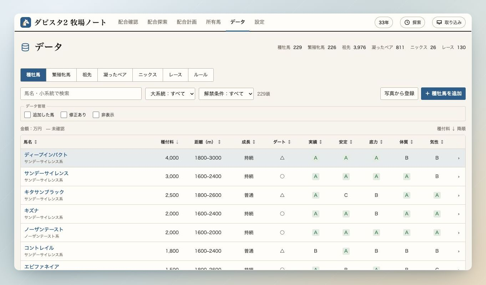
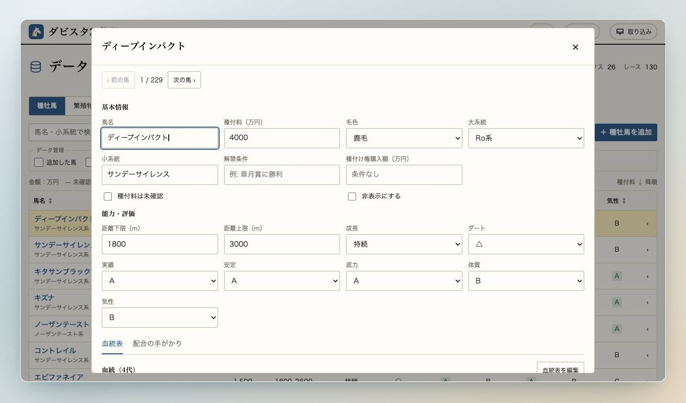
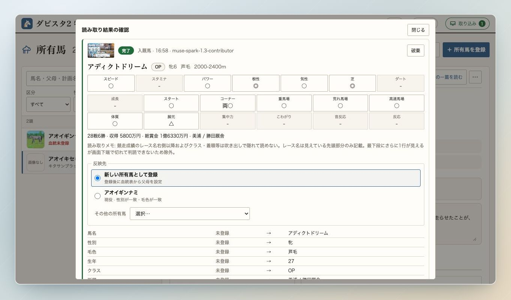

# データ・取り込み・保存

[マニュアルの目次](README.md)

## データを調べる・編集する

「データ」では種牡馬・繁殖牝馬・祖先・凝ったペア・ニックス・レースを閲覧できます。
タブを選び、名前や各タブの条件で絞り込みます。
馬名の検索は、ひらがな・カタカナや、登録済みの英名の日本語読みでも検索できます。

種牡馬・繁殖牝馬の表は、列見出しをクリックすると並べ替えられます。
馬名を開くと、血統や能力などをまとめた詳細ダイアログが表示されます。

データ画面から開いた詳細では、そのまま項目を編集できます。
変更後に表示される保存ボタンで確定します。
探索中に開いた馬の詳細は、編集ボタンから編集に切り替えられます。

## 写真から取り込む

所有馬画面の「写真から取り込み」や、画面右上の「取り込み」からゲーム画面の画像を送ります。
複数枚をまとめて読み取れます。解析中は別の画面で作業し、右上の取り込み一覧から結果へ戻れます。

読み取りが終わったら、馬名・能力・反映先を確認して登録または更新します。
種牡馬一覧の画像から種付料や能力を更新したり、血統画面を所有馬に反映したりすることもできます。

「設定」→「写真の取り込み」で自動登録・更新などの動作を選べます。
写真の読み取りにはAPIの設定が必要です。

## セーブ・ロード

ゲーム内でセーブした時点に合わせて、「設定」→「セーブ・ロード」でアプリの状態も保存できます。

1. 5つのスロットから保存先を選び、「セーブ」を押します。
2. 「33年 春の種付け前」などの名前を付けて保存します。
3. 戻したいときは「ロード」を押し、確認ダイアログで対象を確認します。

保存対象は所有馬・配合計画・設定・データの編集内容です。
ロードすると現在の状態を置き換え、同じサーバに接続している他の端末にも反映します。
取り込み待ちの写真も破棄されるため、残したい作業は先に反映してセーブしてください。

## バックアップと同期

「バックアップ・初期化」では、JSONファイルへの書き出しと復元ができます。
JSONには写真とサーバ上のセーブデータは含まれません。
サーバの移行時は、[READMEの保存方法](../README.md#データの保存)を参照してください。

同じサーバに接続した端末では、所有馬や計画などを共有できます。
接続先や認証トークンの設定は「同期・接続」で行います。

[おまけ：愛馬の一篇へ](horse-story.md)
