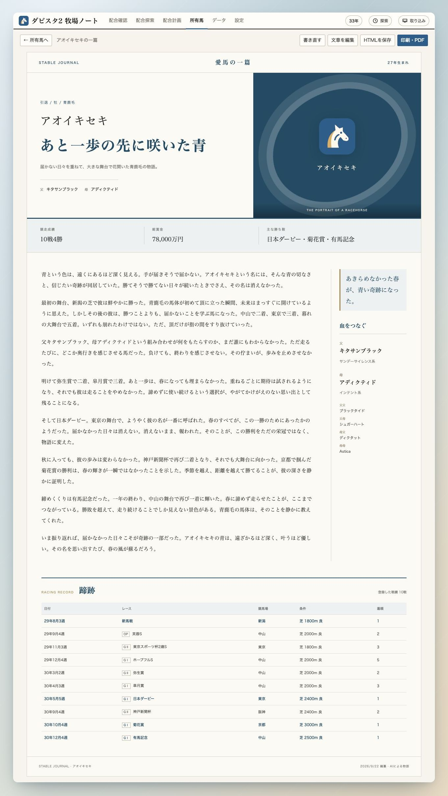

# おまけ：愛馬の一篇

[マニュアルの目次](README.md)

愛馬の戦績や血統、能力、メモをもとに、その馬の歩みを読み物にするおまけ機能です。
育成の思い出を、競馬雑誌の名馬紹介のような記事として残せます。

## 記事を作る

1. 命名済み・デビュー済みの3歳以上の所有馬を開きます。
2. 「愛馬の一篇」を押し、読み味を選びます。
3. 残したい思い出やテーマがあれば入力し、「この馬の物語を綴る」を押します。

戦績やメモを充実させておくと、その馬らしい記事の材料になります。
生成にはAPIの設定が必要です。

## 読む・編集する・残す

生成した記事は所有馬に保存され、「愛馬の一篇を読む」から開けます。
「文章を編集」で表現を整えたり、「書き直す」でテーマや読み味を変えたりできます。

「HTMLを保存」で記事をファイルとして残せます。
紙やPDFにしたいときは「印刷・PDF」を使います。

[マニュアルの目次に戻る](README.md)
