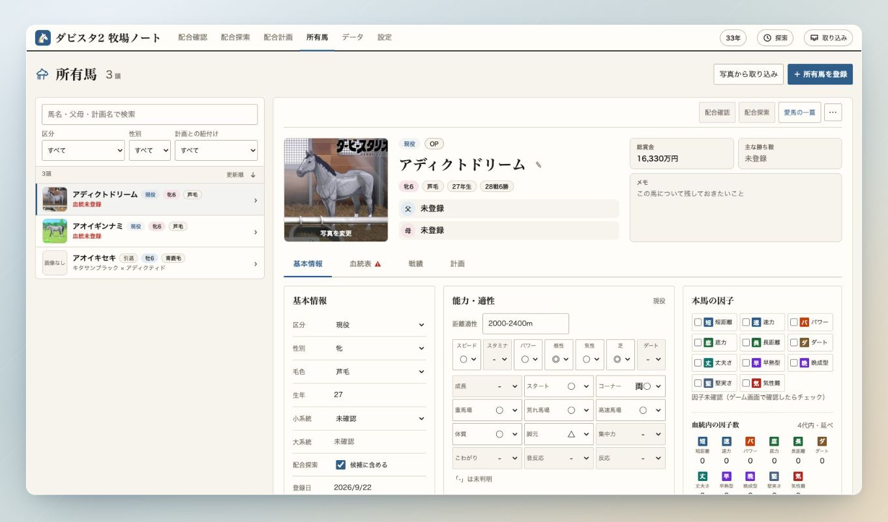
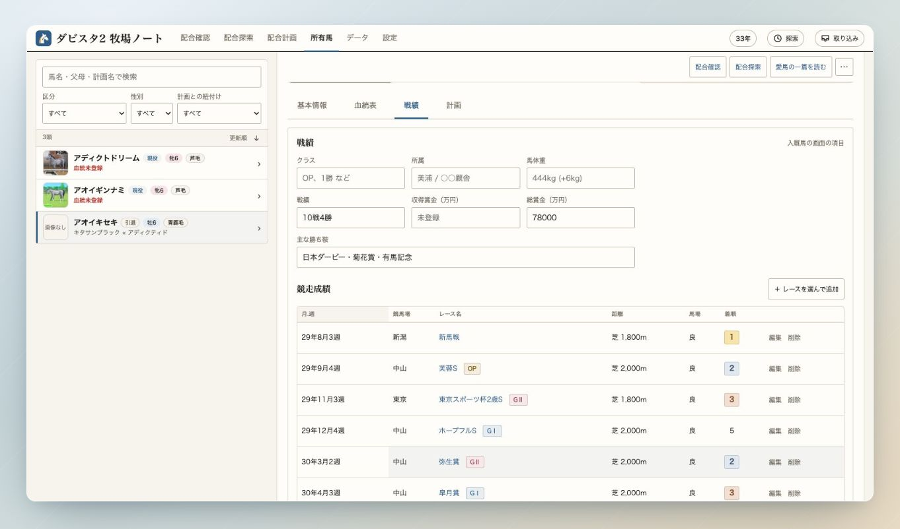
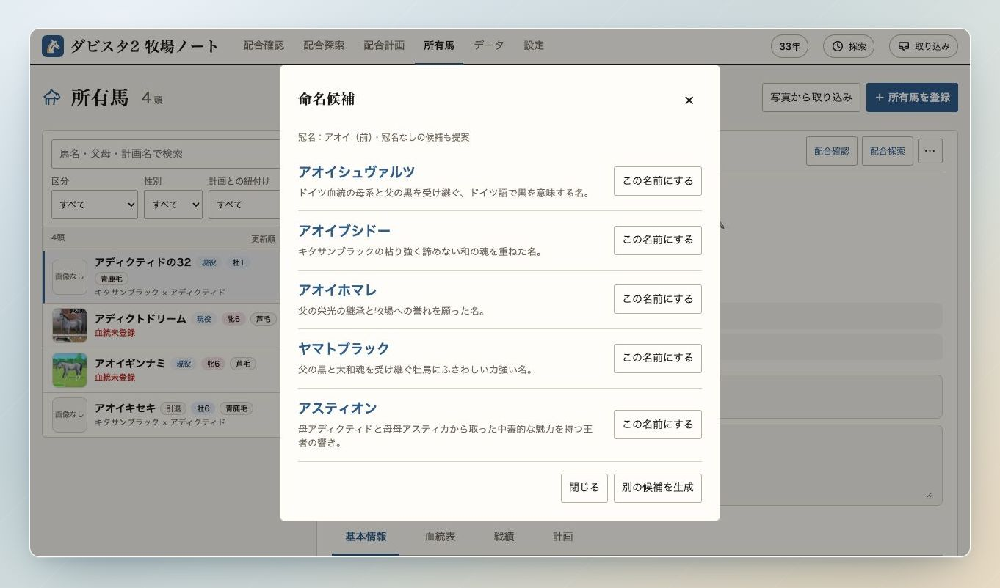

# 所有馬・戦績・命名

[マニュアルの目次](README.md)

## 所有馬を登録・編集する

「所有馬」の「＋ 所有馬を登録」から手動で登録するか、「写真から取り込み」を使います。
一覧は馬名、区分、性別、計画との紐付けで絞り込めます。

一覧から馬を選ぶと、右側で詳細を確認・編集できます。

| タブ | 記録できること |
|---|---|
| 基本情報 | 区分、性別、毛色、生年、能力・適性、本馬の因子など |
| 血統表 | 血統の確認と「血統表を編集」からの父母の登録 |
| 戦績 | 通算成績、主な勝ち鞍、賞金、レースごとの結果 |
| 計画 | 対応する計画馬との紐付け |

内容を変更したら「保存」で確定します。「変更を戻す」で編集中の変更を取り消せます。
能力の項目は区分に応じて変わり、繁殖入り後も現役時の記録を残せます。
年齢は生年と画面右上のゲーム内の年から表示されます。

## 戦績を登録する

「戦績」タブで「＋ レースを選んで追加」を押します。
レース名・競馬場や開催月で探して選ぶと、競馬場、格付け、芝・ダート、距離などが入力されます。
月・週、馬場状態、着順を確認し、「戦績に追加」を押してから所有馬を保存します。

新馬戦・未勝利戦・1〜3勝クラス・オープンは「よく使うレース」から選べます。
これらは競馬場や距離を指定して登録します。データにないレースは手入力もできます。
登録済みの行は、レース名または「編集」から修正できます。

## 命名候補

まず「設定」→「牧場設定」で牧場名と冠名を設定します。
冠名は牡牝共通・別々を選び、馬名の前後どちらに付けるか指定できます。
ひらがなはカタカナに変換され、漢字・英数字などは受け付けません。

1. 「アディクティドの32」のような未命名の馬を開きます。
2. 馬名の横にある「命名候補を生成」を押します。
3. 名前と由来を見て「この名前にする」を選び、所有馬の「保存」で確定します。

候補は父母の情報、自家生産の父母の戦績、3代の血統などをもとに生成されます。
冠名を設定している場合は、冠名付き3案と冠名なし2案です。
「別の候補を生成」で考え直すこともできます。

APIの設定が必要です。生成の設定方法は[README](../README.md#起動)を参照してください。

[データ・取り込み・保存へ](data-and-settings.md)
